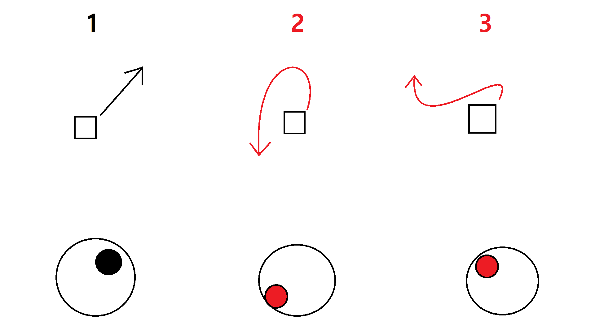

# WeCandyFenceIt! 2 폭격기 세부 기획

#### 목차

1.  개요
2.  기능
    1.  이동
    2.  폭격
    3.  아이템 사용
    4.  모듈 장착
3.  특징
4.  레퍼런스

-----

## 1. 개요

본 기획서는 WeCandyFenceIt! 2의 게임 내 등장하는 **플레이어블 오브젝트(폭격기)** 의 세부 기획이 작성된 기획서입니다.

----

## 2. 기능

### 2.1. 이동

*   폭격기 오브젝트는 **조이스틱**을 통해 이동 명령을 입력받습니다.

*   폭격기 오브젝트는 **자기 자신의 정면을 향해 무한 등속 이동**합니다.

*   폭격기는 **회전이 가능**합니다.

*   이동 방향과 다른 방향의 조이스틱 입력을 받은 경우 해당 방향을 향해 속력을 유지한 채 회전하며 이동합니다.

    *   이와 같은 운동을 **회전 대응 이동**이라 지칭합니다.

    **Ref. 회전 대응 이동(1 -> 2 -> 3 대로 조이스틱 입력값이 연속적으로 추가된 경우)** 

    

*   **폭격 버튼**을 터치하여 폭격을 진행할 수 있습니다.

### 2.2. 폭격

**폭격 버튼**을 누를 시 진행되는 폭격은 젤리 

