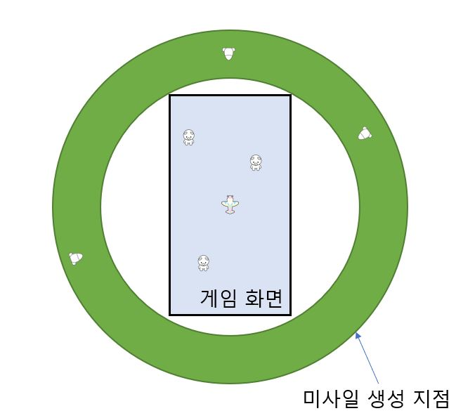

# 미사일 세부 기획

#### 목차

1.  개요
2.  기능
    1.  생성
        1.  점수 구간별 생성 패턴
        2.  생성 장소
    2.  이동
        1.  속도와 회전
        2.  추적
            1.  플레어 추적
    3.  폭발
        1.  플레이어와 충돌
        2.  같은 미사일과 충돌
    4.  기타 사양

-----

## 1. 개요

게임 내 플레이어가 요격당하는 수단인 미사일에 대한 세부 기획입니다.

## 2. 기능

미사일은 다음과 같은 기능을 가지고 있습니다.

*   생성

    미사일은 폭격기가 위치한 게임 화면 바깥에서 생성됩니다. 따라서 **플레이어는 미사일이 어디에서 생성되었는지 확인할 수 없습니다.**

*   이동

    미사일은 생성된 순간부터 실시간으로 폭격기의 위치를 추적해 폭격기를 향해 이동합니다. 

    미사일은 **폭격기보다 빠르게 움직이지만 회전각이 좁아 폭격기보다 넓게 회전합니다.**

*   폭발

    미사일은 **폭격기**, **미사일** 오브젝트와 충돌 시 폭발합니다. 

### 2.1. 생성

#### 2.1.1. 점수 구간별 생성 패턴

미사일은 플레이어의 점수에 따라 생성 주기가 달라집니다.

자세한 생성 주기는 다음과 같습니다.

*   0~49점
    -   미사일이 등장하지 않습니다.
*   50~99점
    *   10초마다 한 개의 미사일이 생성됩니다.
*   100~299점
    -   8초마다 한 개의 미사일이 생성됩니다.
*   300~499점
    *   6초마다 한 개의 미사일이 생성됩니다.
*   500점~
    -   4초마다 한 개의 미사일이 생성됩니다.

미사일 생성 패턴이 적용되는 주기는 추후 수정될 수 있으므로, 기획자가 생성 주기를 실시간 수정할 수 있도록 구조를 구현합니다.

#### 2.1.2 생성 장소

미사일은 생성 시 아래와 같이 스마트폰에 표시되는 게임 화면 바깥에서 생성됩니다. 

### 2.2. 이동

#### 2.2.1 속도와 회전

미사일의 속도는 폭격기보다 빠르되 회전각이 작도록 설정됩니다.

미사일 속도 및 회전각은 기획자가 실시간 수정이 가능한 구조로 구현해야 합니다.

#### 2.2.2 추적

미사일은 폭발하기 전까지 실시간으로 폭격기의 위치를 추적해 그 위치를 향해 등속 이동합니다.

### 2.3. 폭발

#### 2.3.1 충돌

##### 2.3.1.1. 플레이어와 충돌

미사일은 폭격기와 충돌할 경우 폭발합니다.

폭격기가 폭발하게 되면 게임이 종료됩니다.

단, 폭발 시 폭격기가 모듈을 하나 이상 장착한 상태라면 장착한 모듈 중 무작위로 하나의 모듈이 폭격기 대신 파괴됩니다.

##### 2.3.1.2 미사일과 충돌

미사일이 이동하던 도중 같은 미사일과 충돌할 경우 폭발합니다.

미사일끼리 충돌하게 되면 **충돌하여 파괴된 미사일 하나당 20점의 점수를 획득**합니다.

## 4. 기타 사양

위에 명시되지 않은 기타 사양이 작성되는 공간입니다.

#### 4.1. 인게임(In-game) 크기

폭격기 크기의 40% 크기로 스프라이트를 적용합니다.

