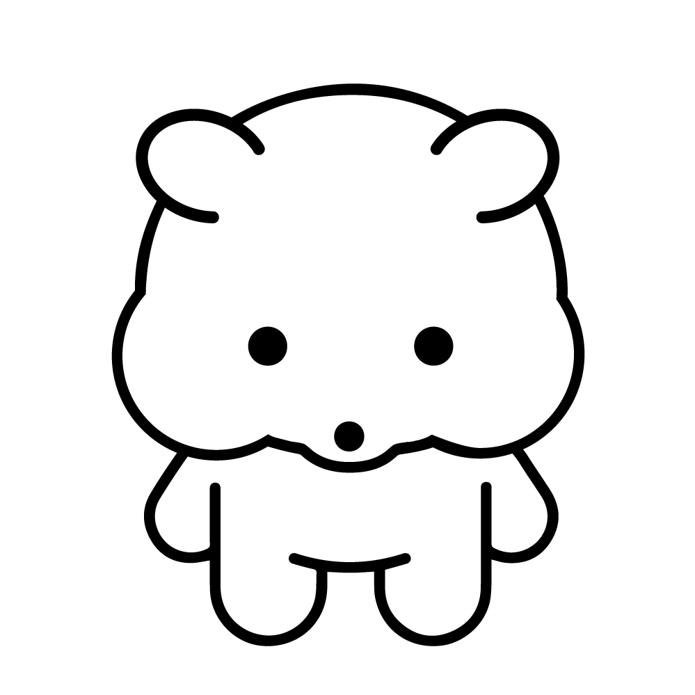
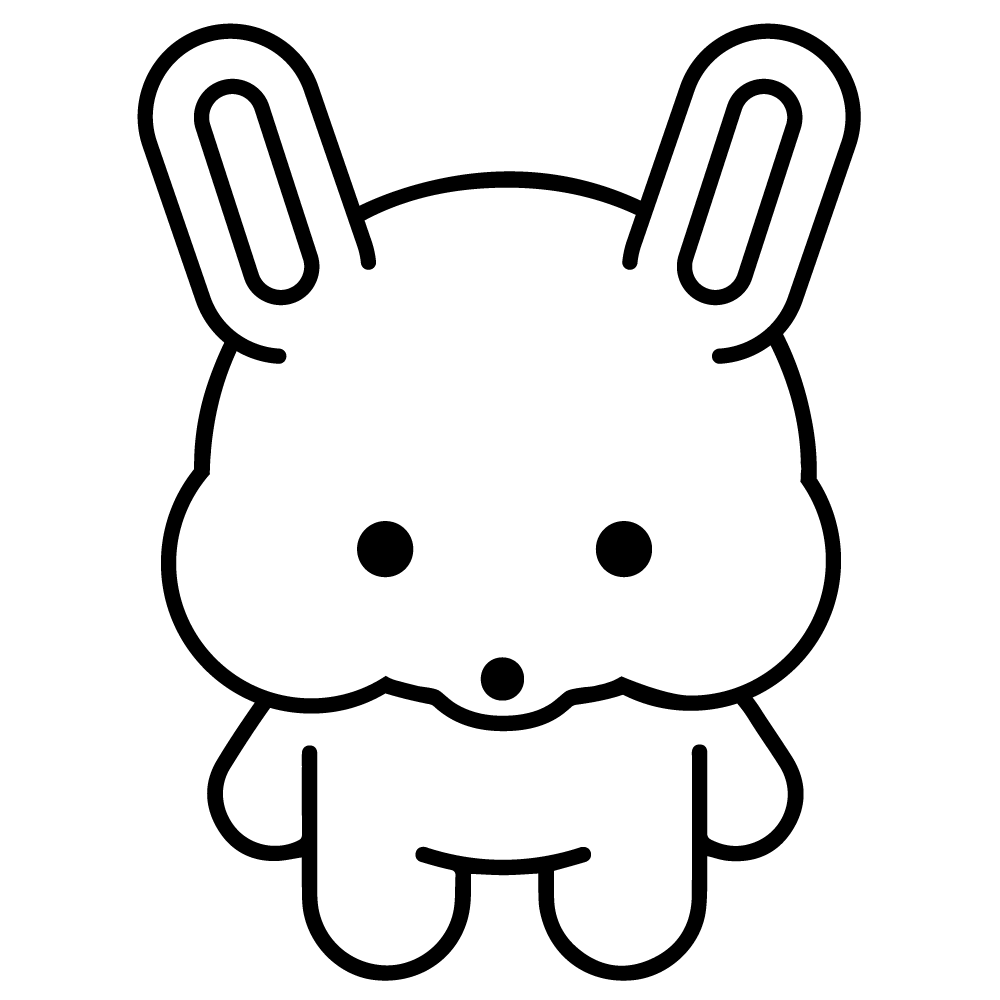
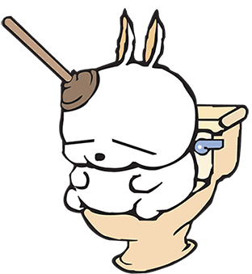
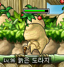

# 젤리 그래픽 리소스 기획서

#### 목차

1.  개요
2.  곰 젤리
    1.  컨셉
    2.  레퍼런스
    3.  애니메이션
    4.  주요 사양 및 작업 시 유의사항
3.  햄스터 젤리
    1.  컨셉
    2.  레퍼런스
    3.  애니메이션
    4.  주요 사양 및 작업 시 유의사항
4.  토끼 젤리
    1.  컨셉
    2.  레퍼런스
    3.  애니메이션
    4.  주요 사양 및 작업 시 유의사항
5.  킹콩 젤리
    1.  컨셉
    2.  레퍼런스
    3.  애니메이션
    4.  주요 사양 및 작업 시 유의사항
6.  젤리 대왕
    1.  컨셉
    2.  레퍼런스
    3.  애니메이션
    4.  주요 사양 및 작업 시 유의사항
    
    

-----

## 1. 개요

'젤리'는 게임 내에서 폭격기(플레이어)가 폭격을 통해 터뜨릴 수 있는 움직이는 대상입니다.

젤리가 터질 시 해당 젤리의 종류에 대응하는 점수를 획득합니다.

## 2. 곰 젤리

### 2.1. 컨셉

이족보행하는 곰돌이 형태로 디자인합니다.

### 2.2 레퍼런스

### 2.3. 애니메이션

곰 젤리는 총 2개의 애니메이션이 필요합니다.

*   이동 애니메이션
*   사망 애니메이션

### 2.4. 주요 사양 및 작업 시 유의사항

*   1000x1000 크기 캔버스에서 제작합니다.
*   제작 시 외곽선을 짙게 설정하고, 내부를 투명하게 디자인합니다.

## 3. 햄스터 젤리

### 3.1. 컨셉

이족보행하는 햄스터 형태로 디자인합니다.

### 3.2. 레퍼런스

### 3.3. 애니메이션

햄스터 젤리는 총 2개의 애니메이션이 필요합니다.

*   이동 애니메이션
*   사망 애니메이션

### 3.3. 주요 사양 및 작업 시 유의사항

*   1000x1000 크기 캔버스에서 제작합니다.
*   제작 시 외곽선을 짙게 설정하고, 내부를 투명하게 디자인합니다.

## 4. 토끼 젤리

### 4.1. 컨셉

이족보행 하듯이 서 있되 두 다리로 깡총깡총 뛰는 점을 염두에 두고 디자인합니다.

### 4.2. 레퍼런스

### 4.3. 애니메이션

토끼 애니메이션은 총 2가지 애니메이션이 필요합니다.

*   점프 애니메이션
*   사망 애니메이션

### 4.4. 주요 사양 및 작업 시 유의사항

*   1000x1000 크기 캔버스에서 제작합니다.

*   점프하는 애니메이션이 잘 구분될 수 있도록 디자인합니다.
*   제작 시 외곽선을 짙게 설정하고, 내부를 투명하게 디자인합니다.

## 5. 킹콩 젤리

### 5.1. 컨셉

어깨가 넓고 팔이 두꺼운 고릴라가 4족보행 하는 형태로 디자인합니다.

### 5.2. 레퍼런스

### 5.3. 애니메이션

킹콩 젤리는 총 4개의 애니메이션이 필요합니다.

*   걷는 애니메이션
*   화를 내는 애니메이션
*   빠르게 뛰는 애니메이션
*   사망 애니메이션

### 5.4. 주요 사양 및 작업 시 유의사항

*   1000x1000 크기에서 제작합니다.
*   제작 시 외곽선을 짙게 설정하고, 내부를 투명하게 디자인합니다.

## 6. 젤리 대왕

### 6.1. 컨셉

아주 크고 나이가 많은 할아버지 곰돌이 젤리의 형태이며, 망토를 두르고 머리 왼쪽 위에 왕관을 얹은 형태입니다.

1자로 찢어진 눈과, 회색 수염을 넣어 디자인합니다.

매우 천천히 이동합니다.

### 6.2. 레퍼런스

(위 레퍼런스처럼 찢어진 눈으로 디자인해 주시고, 레퍼런스의 뚫어뻥 위치에 작은 왕관을 넣으면 될 것 같습니다.)

(위 레퍼런스들처럼 수염이 있고 늙은 캐릭터라는걸 알 수 있도록 디자인해주세요.)

### 6.3. 애니메이션

젤리 대왕은 총 2개의 애니메이션이 필요합니다.

*   이동 애니메이션
*   사망 애니메이션

### 6.4. 주요 사양 및 작업 시 유의사항

*   1500x1500 크기에서 제작합니다.

*   제작 시 외곽선을 짙게 설정하고, 내부를 투명하게 디자인합니다.

*   젤리 대왕은 다른 젤리들보다 매우 느리게 이동하므로, 이동 애니메이션에 사용되는 프레임을 많이 넣어서 제작해야 합니다.

    (프레임 수가 적으면 애니메이션이 끊겨 보일 수 있습니다.)