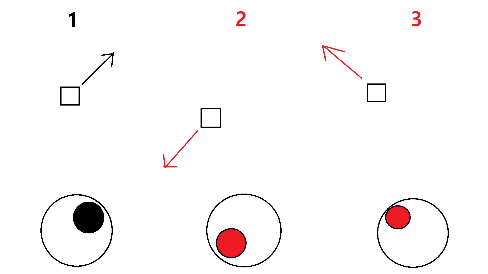
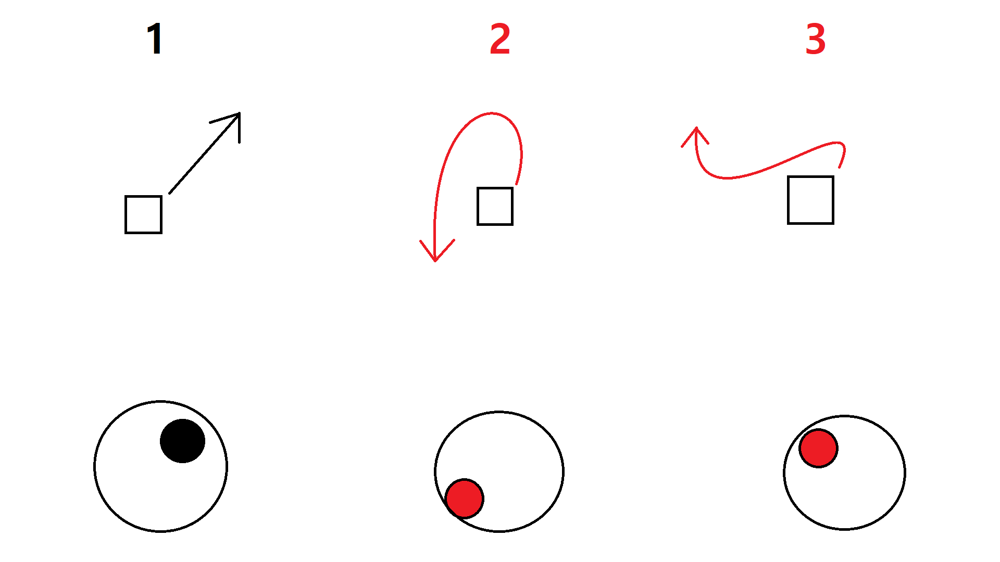

# WeCandyFenceIt! 2 메인 기획

#### 목차

1.  게임 개요
    1.  제목
    2.  플랫폼
    3.  배경과 스토리
    4.  조작법
    5.  점수와 패배 조건
2.  게임 시스템
    1.  폭격기(플레이어블 캐릭터)
    2.  젤리(목표물)
    3.  폭탄
    4.  미사일
    5.  아이템
    6.  모듈
    7.  점수

3.  게임 컨텐츠
    1.  젤리
        1.  곰 젤리
            1.  등장 구간과 확률
            2.  점수
        3.  행동 패턴
        2.  햄스터 젤리
            1.  등장 구간과 확률
            2.  점수
            3.  행동 패턴
        3.  토끼 젤리
            1.  등장 구간과 확률
            2.  점수
            3.  행동 패턴
        4.  킹콩 젤리
            1.  등장 구간과 확률
            2.  점수
            3.  행동 패턴
        5.  젤리 대왕
            1.  등장 구간과 확률
            2.  점수
            3.  행동 패턴
    2.  미사일
        1.  개요
        2.  이동 패턴
        3.  점수 구간별 생성 패턴
        4.  아이템 생성 확률
    3.  아이템
        1.  개요
        2.  플레어 캔디
        3.  네이팜 캔디
        4.  타임 캔디
    4.  모듈
        1.  개요
        2.  요격 캔디
        3.  폭격 캔디
        4.  증폭 캔디
    5.  점수
        1.  개요
        2.  점수 구간
        3.  젤리별 파괴 점수
        4.  미사일 파괴 점수
    
4.  파트별 작업 컨셉
    1.  그래픽 컨셉
    2.  사운드 컨셉
    3.  UI 컨셉

-----

## 1. 게임 개요

### 1.1. 제목

게임 제목은 **We Candy Fence It! ll** 입니다.

### 1.2. 플랫폼

스마트폰(안드로이드) 환경에서 구동되는 세로형 게임입니다.

### 1.3. 배경

전작 **We Candy Fence It!** 에서 젤리들과의 전쟁에서 가까스로 왕국을 방어해 낸 사탕들은 잠시간의 평화를 만끽합니다. 그러던 와중 젤리들의 재 침공이 시작되며, 이번엔 더욱 악랄한 무기들을 앞세운 젤리들의 강력한 공격에 사탕 왕국은 일전에 없던 큰 위기에 봉착하게 됩니다. 사탕 왕국의 에이스 폭격기 파일럿인 주인공(플레이어)는 자신의 폭격기 CAND-7을 타고 젤리 녀석들에게 뜨거운 맛을 보여주기 위해 출격합니다...

### 1.4. 조작법

*   오른쪽 조이스틱(조종 스틱)을 통해 기체를 움직입니다. 
*   왼쪽 버튼(폭격 버튼)을 터치하여 폭탄을 떨어트릴 수 있습니다. 
*   폭격 버튼 둘레에 존재하는 아이템 버튼을 터치하여 아이템을 사용할 수 있습니다.

1.  **기체 조종 스틱**
2.  **폭격 버튼**
3.  **아이템 버튼**

### 1.5. 점수와 패배 조건

플레이어는 폭격을 통해 젤리들과 젤리의 구조물들을 파괴할 때 마다 각 종류에 대응되는 점수를 획득합니다.

플레이어의 기체가 미사일 등에 맞아 파괴될 경우 패배하며 게임이 종료됩니다.

----

## 2. 게임 시스템

### 2.1. 폭격기(플레이어블 캐릭터)

**폭격기**는 플레이어가 조작할 수 있는 오브젝트입니다. 게임 내에서 단 한개만 존재하며, 폭격기가 파괴될 시 게임에서 패배합니다.

폭격기의 이동은 스틱 방향에 직접 대응(직접 대응 이동)되지 않고, 해당 방향을 향해 회전하는 방식(회전 대응 이동)으로 이동합니다.

**↑직접 대응 이동 방식(X) / 1 → 2 → 3 순서대로 조이스틱을 입력한 경우** 

**↑회전 대응 이동 방식(O) / 1 → 2 → 3 순서대로 조이스틱을 입력한 경우** 

### 2.2. 젤리(목표물)

**젤리**는 플레이어가 폭격을 진행할 대상 오브젝트들을 통칭합니다. 젤리의 종류는 다양하며, 이는 **3.1. 젤리 컨텐츠 기획**에서 확인할 수 있습니다.

젤리가 폭격에 맞아 터질 시 점수를 획득합니다.

젤리는 화면 최상단에서 하단의 사탕 성을 향해 이동합니다.

각 젤리마다 다른 이동 속도 또는 패턴을 가집니다.

### 2.3. 폭탄

**폭탄**은 플레이어가 폭격 버튼을 터치할 시 생성되는 오브젝트입니다. 

폭탄은 생성 후 1초 뒤 폭발하며, 폭발 시 폭발 범위 내에 존재하는 모든 젤리가 터집니다.

폭탄은 한 번에 3개까지 장전되며, 소모한 폭탄은 2초 뒤에 재장전됩니다.

다양한 모듈을 장착하여 폭탄의 성능을 변경할 수 있습니다. 모듈에 대해서는 **2.6.모듈 시스템 기획**과 **3.4. 모듈 컨텐츠 기획**을 참고하세요.

### 2.4. 미사일

**미사일**은 플레이어를 향해 날아오는 오브젝트입니다. 미사일은 플레이어가 특정 점수 구간에 진입할 때 마다 생성 패턴이 변화하며 게임이 진행되는 동안 지속적으로 생성됩니다.

미사일은 실시간으로 플레이어의 위치를 추적하여 마치 유도탄처럼 날아오며 플레이어가 맞을 시 게임에서 패배합니다.

미사일끼리 부딛힐 경우 미사일이 폭발하며, 플레이어가 추가 점수를 획득합니다.

미사일끼리 부딛혀 파괴될 경우 일정 확률로 모듈 또는 아이템이 생성됩니다.

### 2.5. 아이템

**아이템**은 미사일이 파괴될 시 일정 확률로 생성되는 소비형 오브젝트입니다.

아이템은 획득 시 아이템의 종류에 맞는 버튼에 장착되며, 동일 아이템은 최대 2개까지 소지할 수 있습니다.

아이템 버튼을 터치하여 해당 아이템을 사용할 시 아이템 소지 갯수를 1 소모하며 아이템에 해당하는 효과가 발생합니다.

아이템은 다양한 종류가 존재하며, 종류에 대해서는 **3.3. 아이템 컨텐츠 기획**을 참고하세요.

### 2.6. 모듈

**모듈**은 미사일이 파괴될 시 일정 확률로 생성되는 장착형 오브젝트입니다.

모듈은 획득 시 폭격기의 주변에 해당 종류에 대응되는 모듈이 생성되며, 모듈은 폭격기 주위를 돌며 자신의 효과를 지속적으로 발생시킵니다.

모듈은 종류에 상관없이 최대 3개까지 장착할 수 있습니다.

모듈은 다양한 종류가 존재하며, 종류에 대해서는 **3.4. 모듈 컨텐츠 기획**을 참고하세요.

 ### 2.7. 점수

**점수**는 젤리 또는 미사일을 파괴할 시 플레이어가 획득하는 수치입니다.

각 젤리의 종류마다 다른 점수를 획득하며, 미사일의 경우 항상 일정한 점수를 획득합니다.

점수는 정해진 구간이 존재하며, 특정 점수대 구간에 플레이어가 진입한 경우 기존 패턴을 끝내고 해당 구간에 해당하는 젤리 생성 패턴 또는 미사일 생성 패턴이 실행됩니다.

각 젤리별 점수 획득량과 점수 구간은 **3.5. 점수 컨텐츠 기획**을 참고하세요.

----

## 3. 게임 컨텐츠

### 3.1. 젤리

젤리의 종류는 총 5가지가 존재합니다.

*   곰 젤리
*   햄스터 젤리
*   토끼 젤리
*   킹콩 젤리
*   젤리 대왕

#### 3.1.1 곰 젤리

##### 3.1.1.1 등장 구간

*   1단계(0점 이상)부터 등장합니다.

*   등장 확률은 다음과 같습니다
    
    **P = F(n) / (sigma) i = 1 to n F(i) (단, n = 단계, F(n) = Fibonacci(n))**
    $$
    P = F(n) / \sum\limits_{i=1}^nF(i) \quad(단, n = 단계, F(n) = Fibonacci(n))
    $$

##### 3.1.1.2 점수

*   파괴 시 1점을 획득합니다.

##### 3.1.1.3 행동 패턴

*   보통 속도로 걸어옵니다. (속도에 대한 구체적인 기획은 추후 업로드 될 **젤리 세부 기획**을 확인하세요.)

#### 3.1.2 햄스터 젤리

##### 3.1.2.1 등장 구간

*   2단계(50점 이상)부터 등장합니다.

*   등장 확률은 다음과 같습니다.

    **P = F(n-1) / (sigma) i = 1 to n F(i) (단, n = 단계, F(n) = Fibonacci(n))**

$$
P = F(n-1) / \sum\limits_{i=1}^nF(i) \quad(단, n = 단계, F(n) = Fibonacci(n))
$$

##### 3.1.2.2. 점수

*   파괴 시 5점을 획득합니다.

##### 3.1.2.3. 행동 패턴

*   빠른 속도로 뛰어옵니다.

#### 3.1.3. 토끼 젤리

##### 3.1.3.1 등장 구간

*   3단계(100점 이상)부터 등장합니다.

*   등장 확률은 다음과 같습니다.

    **P = F(n-2) / (sigma) i = 1 to n F(i) (단, n = 단계, F(n) = Fibonacci(n))**

$$
P = F(n-2) / \sum\limits_{i=1}^nF(i) \quad(단, n = 단계, F(n) = Fibonacci(n))
$$

##### 3.1.3.2. 점수

*   파괴 시 10점을 획득합니다.

##### 3.1.3.3. 행동 패턴

*   폴짝폴짝 점프하며 뛰어옵니다. 점프 시 순간적으로 속도가 매우 빠른 속도로 증가합니다.

#### 3.1.4 킹콩 젤리

##### 3.1.4.1 등장 구간

*   4단계(300점 이상)부터 등장합니다.

*   등장 확률은 다음과 같습니다.

    **P = F(n-3) / (sigma) i = 1 to n F(i) (단, n = 단계, F(n) = Fibonacci(n))**

$$
P = F(n-3) / \sum\limits_{i=1}^nF(i) \quad(단, n = 단계,F(n) = Fibonacci(n))
$$

##### 3.1.4.2 점수

*   파괴 시 30점을 획득합니다.

##### 3.1.4.3 행동 패턴

*   느린 속도로 걸어옵니다. 이 때 폭탄에 한 번 맞으면 화를 내며 매우 빠른 속도로 뛰어옵니다.
*   총 두 번의 폭격을 받아야 터집니다.

#### 3.1.5 젤리 대왕

##### 3.1.5.1. 등장 구간

*   5단계(500점 이상)부터 등장합니다.

*   등장 확률은 다음과 같습니다.

    **P = F(n-4) / (sigma) i = 1 to n F(i) (단, n = 단계, F(n) = Fibonacci(n))**

$$
P = F(n-4) / \sum\limits_{i=1}^nF(i) \quad(단, n = 단계, F(n) = Fibonacci(n))
$$

##### 3.1.5.2 점수

*   파괴 시 50점을 획득합니다.

##### 3.1.5.3. 행동 패턴

*   매우 느린 속도로 걸어옵니다.
*   총 10번의 폭격을 받아야 터집니다.

### 3.2. 미사일

#### 3.2.1. 개요

**미사일**은 젤리들이 플레이어의 폭격기를 격추시키기 위해 발사하는 오브젝트이며, 폭격기와 동일한 이동 방식으로 움직이나 회전 속도가 폭격기보다 느립니다.

#### 3.2.2. 이동 패턴

*   특정 프레임마다 플레이어가 위치한 방향을 추적하며 플레이어에게 이동합니다. 

*   플레이어보다 회전 속도가 느리므로 플레이어가 미사일 가까이에서 회전 시 미사일을 따돌릴 수 있습니다.

#### 3.2.3 점수 구간별 생성 패턴

*   미사일의 생성 위치는 랜덤한 화면 가장자리이며, 생성 주기는 다음 공식을 따릅니다.

    **I = 10*(7-n)/5(sec) (단, n = 단계, n>1)**

$$
I = 10*\frac{7-n}{5}(sec)\quad(단, n = 단계, n>1)
$$

>예를 들어, 1단계의 경우 미사일이 생성되지 않으며,
>
>2단계의 경우 10*(7-1)/5 초마다 미사일이 생성되므로 10초에 한 개씩 생성되어 플레이어를 추적합니다.
>
>3단계의 경우 10*(7-2)/5 초마다 미사일이 생성되므로 8초에 한 개씩 생성되어 플레이어를 추적합니다.
>
>4단계의 경우 위 공식에 따라 6초에 한 개씩 생성되어 플레이어를 추적하며
>
>5단계의 경우 4초에 한 개씩 생성되어 플레이어를 추적합니다.

#### 3.2.4. 아이템 생성 확률

*   아이템의 경우 40%의 확률로 3종류 중 1개의 아이템이 랜덤하게 등장합니다.
*   모듈의 경우 10%의 확률로 3종류 중 1개의 아이템이 랜덤하게 등장합니다.
*   아이템과 모듈은 동시에 등장할 수 없으며, 둘 중 하나만이 등장하게 됩니다.

### 3.3. 아이템

#### 3.3.1 개요

**아이템**은 미사일이 파괴될 시 일정 확률로 생성되는 소비형 오브젝트입니다.

#### 3.3.2. 플레어 캔디

**플레어 캔디**는 이름대로 플레어를 사용할 수 있는 아이템입니다.

플레어를 사용하면 범위 내의 플레이어를 추적하던 미사일들이 모두 제거됩니다.

#### 3.3.3. 네이팜 캔디

**네이팜 캔디**는 네이팜 폭탄을 1회 폭격하는 아이템입니다.

네이팜 캔디를 사용하면 네이팜 폭탄 폭격이 실행되며, 해당 폭발 반경이 10초 동안 매 초마다 1회의 폭격이 이루어진 것과 동일하게 불타오릅니다.

#### 3.3.4. 타임 캔디

**타임 캔디**는 일시적으로 시간을 멈추는 아이템입니다.

타임 캔디를 사용하면 5초간 폭격기(플레이어)를 제외한 모든 오브젝트가 멈추게 됩니다.

### 3.4. 모듈

#### 3.4.1 개요

**모듈**은 미사일이 파괴될 시 일정 확률로 생성되는 장착형 오브젝트입니다.

#### 3.4.2 요격 캔디

**요격 캔디**는 플레이어 주위를 돌며 플레이어를 추적하는 미사일을 공격하여 격추하는 모듈입니다.

요격 캔디의 공격은 1초마다 이루어지며, 공격을 3회 받은 미사일은 파괴됩니다.

#### 3.4.3. 폭격 캔디

**폭격 캔디**는 폭탄 재장전 시간을 절반 감소시키는 모듈입니다.

폭격 캔디의 효과는 중첩됩니다.

#### 3.4.4. 증폭 캔디

**증폭 캔디**는 폭탄의 폭발 반경을 20% 증가시키는 모듈입니다. 

증폭 캔디의 효과는 중첩됩니다.

### 3.5. 점수

#### 3.5.1 개요

**점수**는 젤리 또는 미사일을 파괴할 시 플레이어가 획득하는 수치입니다.

#### 3.5.2 점수 구간

*   0~49 : 1단계
    *   등장 젤리 : 곰 젤리
    *   미사일 등장 패턴 : X(등장하지 않음)
*   50~99 : 2단계
    *   등장 젤리 : 곰 젤리, 햄스터 젤리
    *   미사일 등장 패턴 : 10초마다 등장
*   100~299 : 3단계
    *   등장 젤리 : 곰 젤리, 햄스터 젤리, 토끼 젤리
    *   미사일 등장 패턴 : 8초마다 등장
*   300~499 : 4단계
    *   등장 젤리 : 곰 젤리, 햄스터 젤리, 토끼 젤리, 킹콩 젤리
    *   미사일 등장 패턴 : 6초마다 등장
*   500~ : 5단계
    *   등장 젤리 : 곰 젤리, 햄스터 젤리, 토끼 젤리, 킹콩 젤리, 젤리 대왕
    *   미사일 등장 패턴 : 4초마다 등장

#### 3.5.3. 젤리별 파괴 점수

*   곰 젤리 : 1점
*   햄스터 젤리 : 5점
*   토끼 젤리 : 10점
*   킹콩 젤리 : 30점
*   젤리 대왕 : 50점

#### 3.5.4. 미사일 파괴 점수

*   파괴된 미사일마다 20점 증가

---

## 4. 게임 컨셉

### 1. 그래픽 컨셉

*   아기자기한 아트 디자인과 화사한 파스텔/원색 톤의 채색을 바탕으로 합니다.

*   공중전이라는 특성상 지상에서 움직이는 젤리 및 미사일의 오브젝트 크기가 작기 때문에 각 리소스별로 구분이 쉽도록 디자인해야 합니다.
*   폭발 이펙트 애니메이션이나 젤리가 터지는 이펙트 등에 타격감을 느낄 수 있도록 제작해야 합니다.
*   인트로 씬에 만화적 연출을 위한 컷신 제작이 필요할 수 있습니다.

### 2. 사운드 컨셉

*   밝고 경쾌한 BGM이 필요합니다.
*   경쾌함을 유지하되 긴박한 느낌을 줄 수 있는 BGM이 필요합니다.
*   게임 시작/종료를 알리는 이펙트 사운드가 필요합니다.
*   각 오브젝트가 파괴될 때 타격감을 느낄 수 있는 이펙트 사운드가 필요합니다.
*   모든 이펙트 사운드/BGM은 높은 옥타브(음역대)를 이용해 제작하는 것을 권장합니다.

### 3. UI 컨셉

*   오른손잡이 플레이어에게 특화된 UI를 가지되, 설정을 통해 조이스틱과 폭격/아이템 버튼의 위치를 스위칭할 수 있도록 지정합니다.
*   최대한 적은 정보를 화면에 담아 플레이-인 화면을 가리는 상황이 발생하지 않도록 합니다.
*   자세한 UI 디자인은 추후 작성될**UI 세부 기획**을 확인하세요.