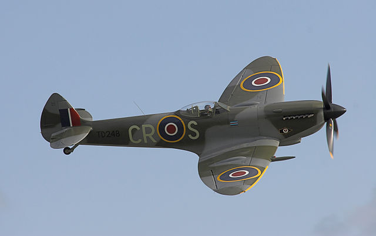
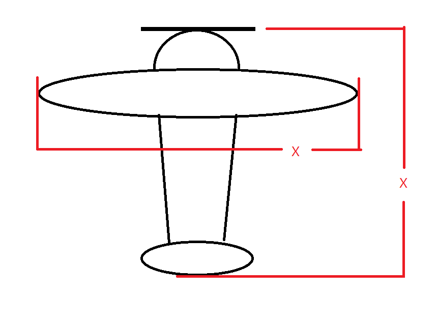
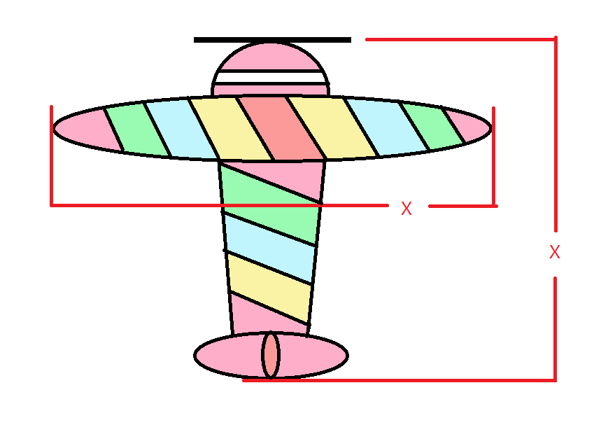

# 폭격기 리소스 세부 기획

#### 목차

1.  개요
2.  컨셉
3.  레퍼런스
4.  주요 사양 및 작업 시 주의사항

-----

## 1. 개요

본 기획서는 WeCandyFenceIt! 2의 플레이어블 오브젝트의 그래픽 리소스에 관한 기획서입니다.

**폭격기**는 플레이어가 조종하는 비행기 형태의 오브젝트이며, 게임 내에 오직 하나만 존재합니다.

----

## 2. 컨셉

폭격기의 컨셉은 다음과 같습니다.

*   단엽 프롭기 형태의 기체
*   분홍색의 기본 색상+ 연두, 노랑 등의 파스텔 색상 스트라이프 무늬
*   날개를 포함한 동체 폭과 기체 길이 비율이 동일

*   기체 전면 프로펠러 존재

-----

## 3. 레퍼런스

**ref 01. 단엽 프롭기 - 한 쌍의 날개 + 전면 프로펠러**

**ref 02. 리소스 비율**

동체의 길이가 x일 때 날개를 포함한 너비 역시 x가 되도록 제작합니다.

**ref 03. 리소스 색상**

꼭 이렇게 칠할 필요 없이 다양한 파스텔 색의 스트라이프 패턴으로 디자인합니다.

-----

## 3. 주요 사양 및 작업 시 주의사항

*   기본 색상을 포함해 최소 4색으로 디자인할 것
*   리소스의 최소 크기는 200x200px일 것
*   배경을 투명하게 할 것
*   완전히 위에서 바라보는 시점으로 작업할 것
*   검은색(#FFFFFF)의 아웃라인을 반드시 추가할 것

